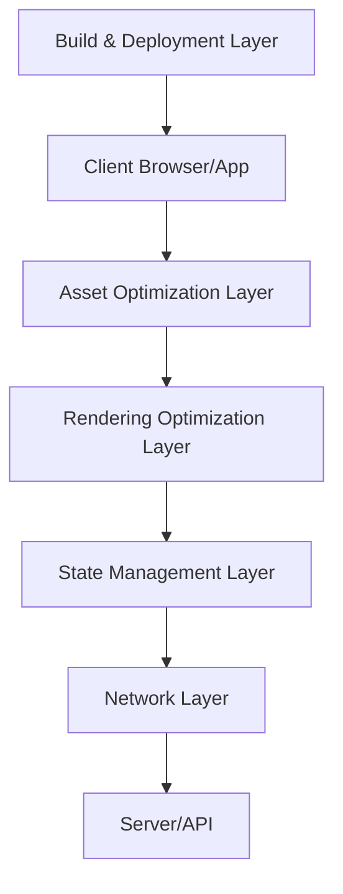

# Design Document: Performance Optimization

## Overview

This design document outlines the approach for optimizing the Next.js application with Capacitor integration to improve loading times, enhance scalability, and ensure efficient resource usage. The application is a dashboard that includes 3D model rendering (GLTF files), uses React Three Fiber, and is deployed on both web and mobile platforms.

## Architecture

The current architecture is a Next.js application with Capacitor integration for mobile deployment. The application uses React Three Fiber for 3D rendering and includes various UI components from Radix UI, along with state management via React Query and Zustand. The application is configured to use Turbopack for development.

We will implement a layered optimization approach:

1. **Asset Optimization Layer**: Handles efficient loading and delivery of assets
2. **Rendering Optimization Layer**: Focuses on efficient rendering of UI and 3D components
3. **State Management Layer**: Ensures efficient state management and data flow
4. **Network Layer**: Optimizes data fetching and API communication
5. **Build & Deployment Layer**: Optimizes the build and deployment process



## Components and Interfaces

### Asset Optimization Components

1. **Image Optimizer**
   - Interface: `OptimizedImage` component extending Next.js Image
   - Responsibilities: Efficient Socket.IO connection management, message batching

## Data Models

### Performance Metrics Model

```typescript
interface PerformanceMetrics {
  fcp: number; // First Contentful Paint
  lcp: number; // Largest Contentful Paint
  fid: number; // First Input Delay
  cls: number; // Cumulative Layout Shift
  ttfb: number; // Time to First Byte
  renderTime: number; // Time to render specific components
  memoryUsage: number; // Memory usage
  frameRate: number; // Frame rate for animations/3D
}
```

### Device Capability Model

```typescript
interface DeviceCapabilities {
  tier: 'low' | 'medium' | 'high'; // Device performance tier
  connection: 'slow-2g' | '2g' | '3g' | '4g' | 'wifi'; // Network connection type
  memory: number; // Available memory
  gpu: {
    tier: 'low' | 'medium' | 'high'; // GPU capability
    features: string[]; // Supported GPU features
  };
}
```

### Asset Configuration Model

```typescript
interface AssetConfig {
  quality: number; // Quality level (0-100)
  format: 'webp' | 'avif' | 'jpg' | 'png'; // Image format
  priority: boolean; // Whether asset is high priority
  placeholder: 'blur' | 'empty' | 'data'; // Placeholder type
  loading: 'eager' | 'lazy'; // Loading strategy
}
```

## Error Handling

1. **Graceful Degradation**
   - Implement fallbacks for failed asset loading
   - Provide simplified rendering modes when performance issues are detected

2. **Performance Error Boundary**
   - Create specialized error boundaries that can switch to lower-performance modes
   - Monitor and report performance-related errors

3. **Asset Loading Error Recovery**
   - Implement retry mechanisms for failed asset loads
   - Provide alternative assets when primary assets fail to load

## Testing Strategy

1. **Performance Benchmarking**
   - Establish baseline performance metrics
   - Implement automated performance testing in CI/CD pipeline
   - Use Lighthouse CI for web performance metrics

2. **Device Testing Matrix**
   - Test on various device tiers (low-end, mid-range, high-end)
   - Test on different network conditions
   - Test on both web and mobile platforms

3. **Load Testing**
   - Simulate high user loads to test scalability
   - Monitor server response times under load
   - Test CDN performance

4. **Memory Profiling**
   - Profile memory usage, especially for 3D rendering
   - Identify and fix memory leaks
   - Test memory usage on low-memory devices

## Implementation Approach

### Web Optimization

1. **Next.js Optimizations**
   - Implement route-based code splitting
   - Use Next.js Image component with proper configuration
   - Implement server components where appropriate
   - Configure proper caching strategies

2. **React Optimizations**
   - Use React.memo for expensive components
   - Implement useMemo and useCallback for performance-critical functions
   - Use virtualization for long lists

3. **3D Rendering Optimizations**
   - Implement LOD (Level of Detail) for 3D models
   - Use instancing for repeated geometries
   - Implement frustum culling
   - Optimize shader complexity

### Mobile Optimization (Capacitor)

1. **Capacitor Configuration**
   - Update webDir to 'out' for static export
   - Configure proper permissions and capabilities

2. **Native Bridge Optimization**
   - Minimize bridge calls
   - Batch communications when possible

3. **Asset Management**
   - Pre-bundle critical assets for mobile
   - Implement proper caching strategies

4. **Memory Management**
   - Implement aggressive garbage collection for 3D scenes
   - Monitor and limit memory usage

## Technical Decisions and Rationales

1. **Using Next.js App Router**
   - Rationale: Provides better code splitting and server components
   - Trade-offs: Newer API with potential stability issues

2. **Zustand for State Management**
   - Rationale: Lightweight, efficient updates, good for performance
   - Trade-offs: Less structured than Redux, may require more discipline

3. **React Query for Data Fetching**
   - Rationale: Built-in caching, background updates, optimistic updates
   - Trade-offs: Additional bundle size, learning curve

4. **Three.js Optimizations**
   - Rationale: Essential for 3D performance, especially on mobile